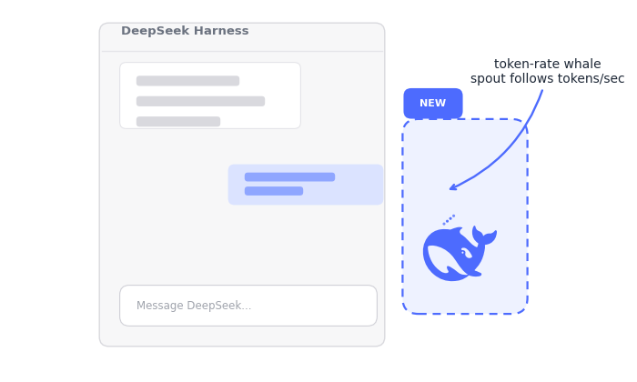

# dsh-client-ui-whale

English | [中文](README.zh.md)

A tiny DeepSeek Harness (DSH) client plugin that puts a DeepSeek-logo whale
at the right edge of the conversation column. Its water spout grows taller and
wider as the current session's token **consumption rate** climbs — the faster
tokens stream, the harder the whale sprays.

> The whale is the official DeepSeek logo shape (from the shipped favicon),
> recolored in the brand blue. DeepSeek is a trademark of DeepSeek; this
> plugin is an independent, unofficial fan project.

## Demo

<p align="center">
  
</p>

The whale lives just to the **right of the conversation column** (the
highlighted "NEW" area in the demo). The spout height, droplet count, and
droplet size all follow the live token consumption rate: idle means no spout,
fast streaming means a tall, wide spray.

## Features

- **Floating whale** pinned just right of the conversation column
  (falls back to the viewport corner when there is no room).
- **Rate-driven spout**: spout height, droplet count, and droplet size all
  scale with the live token consumption rate (tokens/second), sampled every
  400ms and exponential-smoothed from the session's `tokenUsage` projection.
- **Live token badge** under the whale so you can verify the correlation.
- **Dark-mode aware** badge, zero build step, no runtime dependencies.

## How it works

DSH composes its UI from client plugins. This package is a dual-face plugin:

- `lib/index.js` — the Node half: an empty `apply()` that makes the package an
  enabled Loader entry.
- `lib/client.js` — the browser half, loaded by the client module system
  (`window.__ModuleLoader__.load`). It registers one entry into the
  `conversation.session.header.actions` slot (session scope, so the standard
  kit carries `useProjection`), reads `useProjection("tokenUsage")`, and
  portals the whale into `document.body` for viewport-relative positioning.

Token accounting comes from `@deepseek-ai/dsh-token-meter`'s `tokenUsage`
projection (the disjoint buckets `uncachedInputTokens`, `outputTokens`,
`cacheReadTokens`, `cacheWriteTokens`).

## Install

A DSH client plugin must be resolvable from the target profile's `node_modules`
and registered as a Loader row in `cordis.patch.yml`.

### 1. Add the plugin

**From npm (recommended):**

```sh
dsh plugin --profile web add @allen0118/dsh-client-ui-whale
```

This runs `pnpm add` in the profile directory, installing the published
package. (Equivalent: `cd "$DSH_HOME/profiles/web" && pnpm add @allen0118/dsh-client-ui-whale`.)

**From source (symlink — for hacking on the plugin):**

```sh
PROFILE="$DSH_HOME/profiles/web"          # or your profile dir
mkdir -p "$PROFILE/node_modules/@allen0118"
ln -sfn "$(pwd)" "$PROFILE/node_modules/@allen0118/dsh-client-ui-whale"
```

**From a local checkout (file dependency):**

Add to the profile's `package.json`, then run `pnpm install` in the profile
directory:

```json
"dependencies": { "@allen0118/dsh-client-ui-whale": "file:/path/to/dsh-client-ui-whale" }
```

### 2. Register the Loader row

Append to `$PROFILE/cordis.patch.yml`:

```yaml
- insert:
    - id: ui-whale
      name: '@allen0118/dsh-client-ui-whale'
```

### 3. Restart

Restart `dsh web` and refresh — plugin-set changes only take effect on restart.

## Configuration

There is no config surface yet; edit `lib/client.js` directly:

- **Position / gap**: `useWhalePosition()` (gap is `16`, fallback corner is
  `right: 28`, narrow-viewport fallback is `right: 12`).
- **Spout curve**: the `level` expression in `TokenWhale` — currently
  `Math.min(1, Math.sqrt(rate / 50))`, saturating near 50 tokens/second. The
  rate is sampled every 400ms and exponential-smoothed in `useTokenRate()`.
- **Sizes**: `spoutH` (8–80px), `dropCount` (2–6), `dropSize` (3–6px).
- **Colors**: the `.whale-drop` / `.whale-svg` / `.whale-count` CSS rules.

To disable, add `disabled: true` to the `ui-whale` row (or delete the row) and
restart.

## Development

```sh
npm run check   # node --check on both halves
```

`lib/client.js` is hand-maintained plain JavaScript in the exact shape the DSH
client module loader expects; there is intentionally no build step.

## License

[MIT](LICENSE). The DeepSeek logo is used for identification only.
